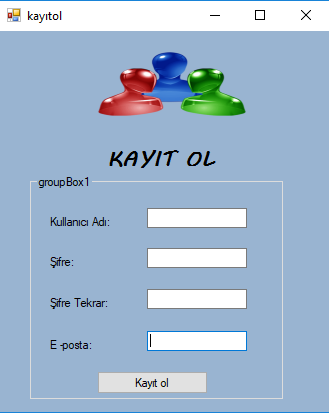
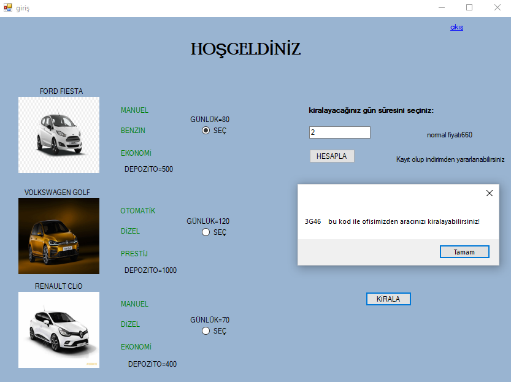
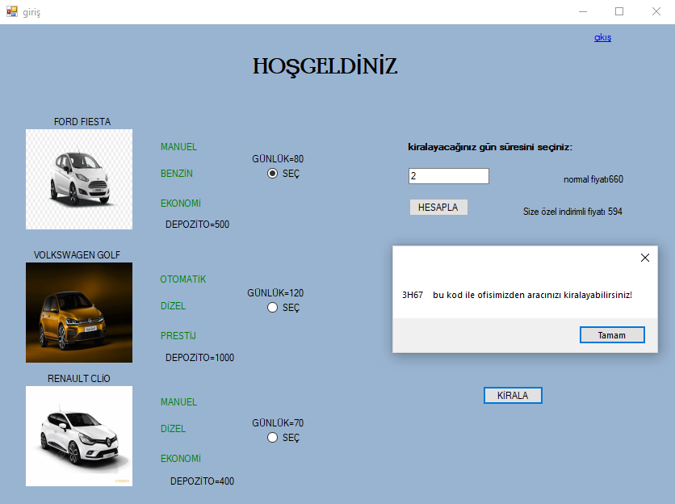

# c-sql-server-connection

c# sharp ı sql e bağlayarak araba kiralama projesidir.Form 1 de kullanıcı adı ve şifrenizi girmeniz gerekmekte yok ise yeni kayıt oluşturabilir veya misafir girişi yapabilirsiniz fakat üye olarak girince kullanıcıya %10 indirim uygulanır misafire ise normal fiyatından kiralanır .Üye olan kişiler veri tabanında saklanır uygulama kapatılıp açılınca takrardan aynı kullanıcı adı ve şifresiyle giriş yapabilirsiniz. Kirala butonuna basınca rastgele bir kod üretiyor.

KODLARI SONU .CS İLE BİTEN KLASÖRLERDEN GÖREBİLİRSİNİZ.UYGULAMAYI GÖRMEK İÇİN KULLANICI.EXE ADLI DOSYAYI İNDİRİP AÇINIZ.
